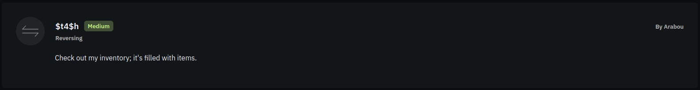

# Challenge Info
| **Name** | **Category** | **Difficulty** | **Challenge Points** | **Author** | **First Blood** |
|:--------:|:------------:|:--------------:|:--------------------:|:----------:|:---------------:|
|   $t4$h  |   Reversing  |     Medium     |      200 Points      |   Arabou   |        No       |

# Challenge Description

It is python indeed, but with no source code this time, only a `__pycache__/` directory with a `stash.cpython-312.pyc` file inside it.

# Obtain Flag
First thing comes to mind is to decompile the python executable and reverse engineer it the old school way using `uncompyle6`

```sh
[flagyard/reverse/$t4$h] uncompyle6 __pycache__/stash.cpython-312.pyc
# uncompyle6 version 3.9.1
# Python bytecode version base 3.12.0 (3531)
# Decompiled from: Python 3.11.8 (main, Feb 12 2024, 14:50:05) [GCC 13.2.1 20230801]
# Embedded file name: c:\Users\momo-\OneDrive\المستندات\brbr\l0G1n_Reverse Engineering_iq0\player\player_files\stash.py
# Compiled at: 2024-03-26 17:52:41
# Size of source mod 2**32: 2498 bytes

Unsupported Python version, 3.12.0, for decompilation


# Unsupported bytecode in file __pycache__/stash.cpython-312.pyc
# Unsupported Python version, 3.12.0, for decompilation
```
Oh, `python3.12` is not supported for decompilation using `uncompyle6`, what should we do then?
Let's do a passive recon for the file before we move to doing something else, we will act as if the file was a regular executable and do the usual stuff.

```sh
[flagyard/reverse/$t4$h] file __pycache__/stash.cpython-312.pyc
__pycache__/stash.cpython-312.pyc: Byte-compiled Python module for CPython 3.12 or newer, timestamp-based, .py timestamp: Tue Mar 26 14:52:41 2024 UTC, .py size: 2498 bytes
```
Nothing interesting, let's see the file content using `strings`

```sh
[flagyard/reverse/$t4$h] strings __pycache__/stash.cpython-312.pyc
N)Hz
Potion of Healing
Scroll of Fireball
Short Sword
Leather Armor
Lockpick Set
Wand of Lightning
Amulet of Protection
Thieves' Tools
Scroll of Teleportation
Dagger
Rations
Torchz&Cloak of InvisibilityPotion of Healingr
z%Cloak of InvisibilityRing of Strengthz
Book of Knowledgez
Holy Water
Slingz
Chain Mail
Antidotez
Crystal Ballz
Scroll of Protectionz
Staff of Healingz
Gem of Powerz
Robe of Stealthz
Throwing Knivesz
Wand of Frostz
Elixir of Agilityz
Scroll of Summoningz
Gloves of Dexterityz
Horn of Resiliencez
Boots of Speed
Spear
Netz
Mirror Shieldz
Book of Shadowsz
Holy Symbolz'Cloak of ResistanceRing of Invisibilityz
Charm of Fortunez
Sword of Flamez
Plate Armorz
Tome of Wisdomz
Elixir of Strengthz
Quiver of Arrowsz
Dagger of Venom
Helm of Brilliance
Scroll of Revival
Amulet of Endurance
Bag of Holding
Orb of Detection
Wand of Disruption
Cape of Flight
Potion of Invisibilityz
Bracelet of Protectionz
Staff of Lightningz
Cloak of Shadowsz
Scroll of Illusionz
Bow of Accuracyz
Horn of Blastingz
Crown of Kingsz
Elixir of Regenerationz
Robe of Elemental Resistancec
Stashc
N)	z(RmxhZ1l7TjBfSXQzbXNfbDNmdF8wbl9zdDRzaH0=r
items
selfs
c:\Users\momo-\OneDrive\
\brbr\l0G1n_Reverse Engineering_iq0\player\player_files\stash.py
__init__z
Stash.__init__R
returnc
Inventory[
lenr
__repr__z
Stash.__repr___
append)
items
  r 
add_itemz
Stash.add_itema
popr
get_itemz
Stash.get_itemd
__name__
__module__
__qualname__r!
strr'
pickle
stash_itemsr
	inventory
dumps
printr4
<module>r;
```
That looks like a fun game to play, anyways, nothing really seems interesting for the challenge at this point, but my eye caught something fimiliar, a base64 encoding-like string `N)	z(RmxhZ1l7TjBfSXQzbXNfbDNmdF8wbl9zdDRzaH0=r`

```sh
[flagyard/reverse/$t4$h] echo 'N)	z(RmxhZ1l7TjBfSXQzbXNfbDNmdF8wbl9zdDRzaH0=r' | base64 -d
base64: invalid input
```
Let's reduce some noise, i mean.. we know that spaces and parentheses are not in base64 encoding

```sh
[flagyard/reverse/$t4$h] echo 'RmxhZ1l7TjBfSXQzbXNfbDNmdF8wbl9zdDRzaH0=r' | base64 -d
FlagY{N0_It3ms_l3ft_0n_st4sh}base64: invalid input
```
Alright, i should've removed the `'r'` after the `=` but that didn't affect the flag, so its ok. Lol that was too easy :D

### Flag
Flag is: `FlagY{N0_It3ms_l3ft_0n_st4sh}`


## But it didn't work?!
Man idk about you, but this is pretty straightforward xP