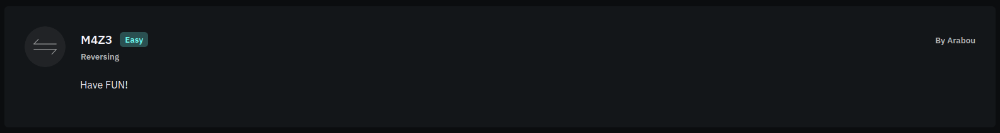

# Challenge Info
| **Name** | **Category** | **Difficulty** | **Challenge Points** | **Author** | **First Blood** |
|:--------:|:------------:|:--------------:|:--------------------:|:----------:|:---------------:|
|   M4Z3   |   Reversing  |      Easy      |      100 Points      |   Arabou   |       Yes       |

# Challenge Description

This is a python challenge with a file called `main.py` containing the source code, indeed it looks easy.

# Obtain Flag
Arabou, the organizers of the challenge wanted to make us play a game before the real deal, and games are fun! Aren't they? right? right..?
<br>
In this challenge, we have a python file containing this code:
```py
class MazeGame:
    def __init__(self):
        self.maze = [
                [' ', ' ', '#', '#', '#', '#', '#', '#', '#', '#', '#', '#', '#', '#', '#', '#', '#', '#', '#', '#', '#', ], 
                [' ', ' ', ' ', ' ', '#', ' ', '#', ' ', ' ', ' ', ' ', ' ', ' ', ' ', ' ', ' ', ' ', ' ', '#', ' ', '#', ],
                ['#', '#', '#', ' ', '#', ' ', '#', ' ', '#', ' ', '#', '#', '#', '#', '#', '#', '#', ' ', '#', ' ', '#', ], 
                ['#', ' ', ' ', ' ', '#', ' ', '#', ' ', '#', ' ', '#', ' ', ' ', ' ', ' ', ' ', ' ', ' ', ' ', ' ', '#', ], 
                ['#', ' ', '#', '#', '#', ' ', '#', '#', '#', '#', '#', ' ', '#', '#', '#', ' ', '#', ' ', '#', '#', '#', ], 
                ['#', ' ', ' ', ' ', '#', ' ', ' ', ' ', ' ', ' ', ' ', ' ', ' ', ' ', '#', ' ', '#', ' ', '#', ' ', '#', ], 
                ['#', '#', '#', ' ', '#', '#', '#', '#', '#', '#', '#', ' ', '#', '#', '#', ' ', '#', '#', '#', ' ', '#', ], 
                ['#', ' ', ' ', ' ', '#', ' ', '#', ' ', '#', ' ', '#', ' ', ' ', ' ', '#', ' ', '#', ' ', '#', ' ', '#', ], 
                ['#', ' ', '#', ' ', '#', ' ', '#', ' ', '#', ' ', '#', '#', '#', '#', '#', ' ', '#', ' ', '#', ' ', '#', ], 
                ['#', ' ', '#', ' ', ' ', ' ', '#', ' ', '#', ' ', ' ', ' ', '#', ' ', ' ', ' ', ' ', ' ', '#', ' ', '#', ], 
                ['#', ' ', '#', '#', '#', ' ', '#', ' ', '#', ' ', '#', '#', '#', ' ', '#', ' ', '#', ' ', '#', ' ', '#', ], 
                ['#', ' ', '#', ' ', ' ', ' ', ' ', ' ', '#', ' ', ' ', ' ', ' ', ' ', '#', ' ', '#', ' ', '#', ' ', '#', ], 
                ['#', '#', '#', ' ', '#', '#', '#', '#', '#', '#', '#', '#', '#', ' ', '#', '#', '#', '#', '#', ' ', '#', ], 
                ['#', ' ', '#', ' ', '#', ' ', ' ', ' ', ' ', ' ', '#', ' ', ' ', ' ', ' ', ' ', ' ', ' ', ' ', ' ', '#', ], 
                ['#', ' ', '#', ' ', '#', '#', '#', ' ', '#', ' ', '#', '#', '#', ' ', '#', ' ', '#', ' ', '#', '#', '#', ],
                ['#', ' ', ' ', ' ', ' ', ' ', ' ', ' ', '#', ' ', '#', ' ', ' ', ' ', '#', ' ', '#', ' ', ' ', ' ', '#', ], 
                ['#', '#', '#', ' ', '#', '#', '#', ' ', '#', ' ', '#', '#', '#', '#', '#', '#', '#', ' ', '#', '#', '#', ], 
                ['#', ' ', ' ', ' ', '#', ' ', ' ', ' ', '#', ' ', ' ', ' ', ' ', ' ', ' ', ' ', '#', ' ', ' ', ' ', '#', ], 
                ['#', '#', '#', ' ', '#', ' ', '#', '#', '#', '#', '#', '#', '#', ' ', '#', ' ', '#', '#', '#', ' ', '#', ], 
                ['#', ' ', ' ', ' ', '#', ' ', ' ', ' ', ' ', ' ', '#', ' ', ' ', ' ', '#', ' ', ' ', ' ', ' ', ' ', '#', ],
                ['#', '#', '#', '#', '#', '#', '#', '#', '#', '#', '#', '#', '#', '#', '#', '#', '#', '#', '#', ' ', '#', ] 
            ]
        self.height = len(self.maze)
        self.width = len(self.maze[0])

        self.player = "O"
        self.player_position = (1, 1)
        self.finish_position = (19, 20)
        self.maze[1][1] = self.player

    def move_player(self, direction):
        x, y = self.player_position
        if direction == 'w' and y > 0 and self.maze[y - 1][x] != '#':
            self.player_position = (x, y - 1)
        elif direction == 's' and y < self.height - 1 and self.maze[y + 1][x] != '#':
            self.player_position = (x, y + 1)
        elif direction == 'a' and x > 0 and self.maze[y][x - 1] != '#':
            self.player_position = (x - 1, y)
        elif direction == 'd' and x < self.width - 1 and self.maze[y][x + 1] != '#':
            self.player_position = (x + 1, y)
        self.maze[y][x] = " "
        moved = not self.player_position == (x, y)
        x, y = self.player_position
        self.maze[y][x] = "O"
        return moved

    def display_maze(self):
        for row in self.maze:
            print("".join(row))
  
    def play(self):
        moved = ""
        self.display_maze()
        moves = 1
        while moves <= 50:
            direction = input("Enter your move (w/a/s/d): ").lower()
            if self.move_player(direction):
                moved+=direction
                moves+=1
                print("\n" * 50) 
                self.display_maze()

            if self.player_position == self.finish_position:
                print("Congratulations! You've reached the end of the maze!")
                print("Here is your flag: FlagY{%s}" % moved)
                break
        else:
            print("NO MOVES LEFT")
 
if __name__ == "__main__":
    print("Hey can you solve my maze?")
    print("You are 'O' and you need to go to 'E'")
    maze = MazeGame()
    maze.play()


```
Let's just play the game, why would we even bother reading the code?

```sh
[flagyard/reverse/m4z3] python main.py
You are 'O' and you need to go to 'E'
  ###################
 O  # #           # #
### # # # ####### # #
#   # # # #         #
# ### ##### ### # ###
#   #         # # # #
### ####### ### ### #
#   # # # #   # # # #
# # # # # ##### # # #
# #   # #   #     # #
# ### # # ### # # # #
# #     #     # # # #
### ######### ##### #
# # #     #         #
# # ### # ### # # ###
#       # #   # #   #
### ### # ####### ###
#   #   #       #   #
### # ####### # ### #
#   #     #   #     #
################### #
Enter your move (w/a/s/d):
```
Nice game huh? Let's continue playing until we reach the end ...

```sh
  ###################
    # #           # #
### # # # ####### # #
#   # # # #         #
# ### ##### ### # ###
#   #         # # # #
### ####### ### ### #
#   # # # #   # # # #
# # # # # ##### # # #
# #   # #   #     # #
# ### # # ### # # # #
# #     #     # # # #
### ######### ##### #
# # #     #         #
# # ### # ### # # ###
#       # #   # #   #
### ### # ####### ###
#   #   #       #   #
### # ####### # ### #
#   #     #   #     #
###################O#
Congratulations! You've reached the end of the maze!
Here is your flag: FlagY{ddssaassddssssddssaassssddddwwddssssddddddssdddds}
```
It was quite a fun game to play, without the headache of reverse engineering anything xD

### Flag
Flag is: `FlagY{ddssaassddssssddssaassssddddwwddssssddddddssdddds}`


## But it didn't work?!
Note that the challenge requires the minimum moves to reach the end, so jumping and hopping around the whole maze will not give you the flag, max steps are `50`.