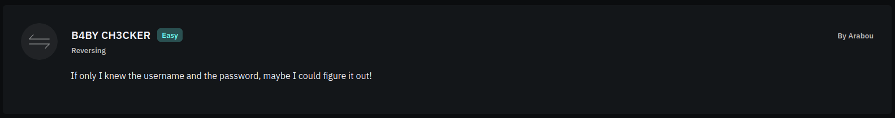

# Challenge Info
|   **Name**   | **Category** | **Difficulty** | **Challenge Points** | **Author** | **First Blood** |
|:------------:|:------------:|:--------------:|:--------------------:|:----------:|:---------------:|
| B4BY CH3CKER |   Reversing  |      Easy      |      100 Points      |   Arabou   |       Yes       |

# Challenge Description

Here goes another python reverse engineering challenge, a file called `main.py` is presented in `chall.zip`.

# Obtain Flag
A classic credentials reverse engineering challenge, try and get the values of both the username and password using the algorithms used in the source code.

```py
from itertools import cycle

def complex_function(chr:str):
    if chr == "i":
        return 0xaa
    if chr == "j":
        return 0xbb
    if chr == "t":
        return 0xcc
    if chr == "d":
        return 0xdd
    if chr == "c":
        return 0xee
    if chr == "j":
        return 0xff
    

def checker(username:str, password:str):
    __ = "gwkeuwr2!uj29ogj23ghhwefh2348tyhgwnf3p49 h5t890ph3f32490 fq3g 28ty2fhj284tghj2ng2g"
    _ = username+password
    ___ = b"\x2f\x06\x07\x10\x68\x49\x03\x58\x05\x17\x4a\x47\x5a\x0f\x51\x13\x05\x51\x07\x5c\x01\x13\x4b\x40\x59\x08\x51\x14\x05\x56\x07\x5c\x0b\x13\x40\x40\x58\x17"
    if not len(_) == 12:
        print("NOPE")
        return
    if not _[0] == "i":
        print("NOPE")
        return
    if not complex_function(_[1]) == 0xbb:
        print("NOPE")
        return
    if not ord(_[2]) == ord("f"):
        print("NOPE")
        return
    if not ord(_[3]) ^ ord("w") == 0:
        print("NOPE")
        return
    if not int(_[4]) * 0x1337 == 0x1337:
        print("NOPE")
        return
    if not _[5] == _[6]:
        print("NOPE")
        return
    if not int(_[5]) // 2 == 1:
        print("NOPE")
        return
    if not int(_[5]) + int(_[6]) + int(_[7]) == 13:
        print("NOPE")
        return
    if not int(_[5]) + int(_[6]) + int(_[7]) - int(_[8]) == 10:
        print("NOPE")
        return
    if not _[11]+_[10]+_[9] == __[len(__)//10:len(_)%10:-(len(__)%80)]:
        print("NOPE")
        return
    
    print(''.join(chr(x ^ ord(y)) for x, y in zip(___, cycle(_))))

if __name__ == "__main__":
    username = input("username: ")
    password = input("password: ")
    checker(username, password)
```
Hmmm, pretty straightforward with that single function called `checker()`, it takes two input's `username` and `password` to do special magic on them, lets give it a shot!

First thing first, this obfuscated naming is uncomfortable, let's rename things for readability:

```py
from itertools import cycle

def complex_function(char:str):
    ...  

def checker(username:str, password:str):
    key_2 = "gwkeuwr2!uj29ogj23ghhwefh2348tyhgwnf3p49 h5t890ph3f32490 fq3g 28ty2fhj284tghj2ng2g"
    user_input = username+password
    xor_key = b"\x2f\x06\x07\x10\x68\x49\x03\x58\x05\x17\x4a\x47\x5a\x0f\x51\x13\x05\x51\x07\x5c\x01\x13\x4b\x40\x59\x08\x51\x14\x05\x56\x07\x5c\x0b\x13\x40\x40\x58\x17"
    ...
    
    print(''.join(chr(x ^ ord(y)) for x, y in zip(xor_key, cycle(user_input))))

if __name__ == "__main__":
    ...
```
Lets take the `checker()` function if statements step by step, here goes the first one:

```py
    if not len(user_input) == 12:
        print("NOPE")
        return
```
It ensure's that the `user_input` is 12 character long, next one:

```py
    if not user_input[0] == "i":
        print("NOPE")
        return
```
Let's make an imaginary buffer so that we can save our progress to get the final result (`buffer = ""`), and the first character is `'i'`
<br><br>
`buffer = "i"`

```py
    if not complex_function(user_input[1]) == 0xbb:
        print("NOPE")
        return
```
Reviewing `complex_function()`, we know that the function returns `0xbb` if the parameter we pass to it is `'j'`, now we know
<br><br>
`buffer = "ij"`

```py
    if not ord(user_input[2]) == ord("f"): #f
        print("NOPE")
        return
```
`ord()` is used to compare the ascii numeric value of the given argument, so `'f'` would be `102`, but we don't need that since it's comparing the ascii value of the same thing, so we know that `user_input[2]` should be `'f'`
<br><br>
`buffer = "ijf"`

```py
    if not ord(user_input[3]) ^ ord("w") == 0: #w
        print("NOPE")
        return
```
This can be explained in two ways:
- one is that we know xor is a self-inversed operator `A ⊕ A = 0`, so xor-ing the same value would give us 0.
- The other way is that we know
```
if A ⊕ B = C
then A ⊕ C = B
```
So if we inverse the equation to be `0 ^ ord("w") == ord(user_input[3])`, knowing that xor has identity-element property `A ⊕ 0 = A`, we would conclude that `0 ^ ord("w")` should indeed equal to the same value `ord("w")`, so that `ord(user_input[3]) == ord('w')`
<br><br>
`buffer = "ijfw"`

```py
    if not int(user_input[4]) * 0x1337 == 0x1337:
        print("NOPE")
        return
```
Its all about math, and here is presented the mathematical operation (multiplication), one of the special properties of it is the identity element property, same as the one in the xor operator, `A * 1 = A`, basically, we would easily know that `int(user_input[4]) * 0x1337 == 0x1337` where `int(user_input[4])` is a number value of `1`
<br><br>
`buffer = "ijfw1"`

```py
    if not user_input[5] == user_input[6]:
        print("NOPE")
        return
```
We know that the character at index `[5]` should equal the one in index `[6]`, but we don't know what the value is yet.
<br><br>
`buffer = "ijfw1??"`

```py
    if not int(user_input[5]) // 2 == 1:
        print("NOPE")
        return
```
Math.. again.., I wouldn't make it complex this time i promise, `//` is for floor division, so it converts the result to the nearest lower number, `A // 2 = 1` so `A = 2` where `A = int(user_input[5])`, so `user_input[5] = '2'`, remember that `user_input[5]` and `user_input[6]` holds the same value.
<br><br>
`buffer = "ijfw122"`

```py
    if not int(user_input[5]) + int(user_input[6]) + int(user_input[7]) == 13:
        print("NOPE")
        return
```
We know the value of both `user_input[5]` and `user_input[6]` is equal to `2`, so `2 + 2 + int(user_input[7]) = 13`, after simple math we would know that `user_input[7] = '9'`
<br><br>
`buffer = "ijfw1229"`

```py
    if not int(user_input[5]) + int(user_input[6]) + int(user_input[7]) - int(user_input[8]) == 10:
        print("NOPE")
        return
```
The same logic as the one above, we know the values of all `user_input[5]` until `user_input[7]`, after plugging them in `2 + 2 + 9 - int(user_input[8]) = 10`, and calculations say `user_input[8] = '3'`.
<br><br>
`buffer = "ijfw12293"`

```py
    if not user_input[11]+user_input[10]+user_input[9] == key_2[len(key_2)//10:len(user_input)%10:-(len(key_2)%80)]:
        print("NOPE")
        return
```
Looks quite scary, but lets break the logic down, first we have `user_input[11]+user_input[10]+user_input[9]`, we are going to ignore this for now, `user_input[9]`..`user_input[11]` is being compared with `key_2[len(key_2)//10:len(user_input)%10:-(len(key_2)%80)]` so lets focus on this first.

We know that python lists are constructed like this `my_list[start:end:step]`, after breaking down the `key_2` indexing elements we get:

```py
start = len(key_2) // 10
end   = len(user_input) % 10
step  = -(len(key_2) % 80)
```
What is `len(key_2)`? It's `82`, what about `len(user_input)`? We knew previously that the `user_input` should be `12` characters long, lets plug-in these values

```py
start = 82 // 10
end   = 12 % 10
step  = -(82 % 80)
```
Now its more clear, the variable `start` would be `8`, `end` would be `2`, finally `step` would be `-2`, lets put these values back in `key_2`

```py
key_2 = "gwkeuwr2!uj29ogj23ghhwefh2348tyhgwnf3p49 h5t890ph3f32490 fq3g 28ty2fhj284tghj2ng2g"

start = 82 // 10	# 8
end   = 12 % 10		# 2
step  = -(82 % 80)	# -2

key_2[start:end:stop]	# key_2[8:2:-2]
```
The value of `key_2[8:2:-2]` then would be `"!ru"`, lets get back to the step we ignored `user_input[11]+user_input[10]+user_input[9]`, this is ordered in reverse from 11 to 9, and the value we got was `"!ru"`, so the values of `user_input[11]`, `user_input[10]`, and `user_input[9]` would be `'!'`, `'r'`, and `'u'` respectively.
<br><br>
`buffer = "ijfw12293ur!"`

```py
print(''.join(chr(x ^ ord(y)) for x, y in zip(___, cycle(_))))
```
This is the algorithm to print the flag, we don't need to reverse this.
<br>

Yes! We've got the full `user_input` value, what should we do next? Or to be more specific, what values should i assign for both `username` and `password`. In this case, it doesn't really matter what values are in `username` and `password` since they will be combined in a single string.
<br><br>
Let's run the program to test our `buffer`

```sh
[flagyard/reverse/b4by_ch3cker] python main.py
username: ijfw12293ur!
password:
FlagY{1a6b8f3e7d4c5e2f9a0b7c4d5e8f2a1}
```
_Note that `password` is empty becuase we assigned the whole value to `username`._


### Flag
Flag is: `FlagY{1a6b8f3e7d4c5e2f9a0b7c4d5e8f2a1}`


## But it didn't work?!
- Check if the source code is the original one and not something you modified.
- Move slowly and write down your progress on a notebook or in a textfile.
- Check that you did assign values correctly and in-order in the last step, because we were assigning values backwards.