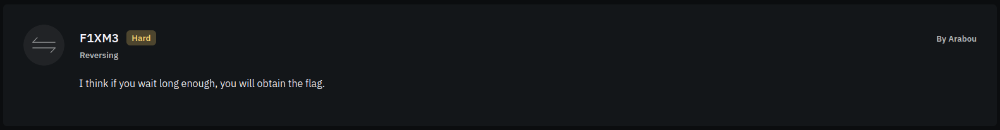

# Challenge Info
| **Name** | **Category** | **Difficulty** | **Challenge Points** | **Author** | **First Blood** |
|:--------:|:------------:|:--------------:|:--------------------:|:----------:|:---------------:|
|   F1XM3  |   Reversing  |      Hard      |      300 Points      |   Arabou   |        No       |

# Challenge Description

Yet another python challenge, its a one filer `main.py` also, we need to optimize this code to be more efficient to get the flag.

# Obtain Flag
Lets see the file content to judge what should we do.

```py
import time

def recursive(a1):
  if not a1:
    return 3
  if ( a1 == 1 ):
    return 5
  v1 = 2 * recursive(a1 - 1)
  return v1 + 3 * recursive(a1 - 2)


flag = b"\x45\x69\xc2\xa2\xda\x3e\xfa\xb5\x56\xda\xcd\x76\xb0\xa1\xfc\x71\x33\x5a\xcc\xb5\xf7\x2c\xce\xec\x79\xe0\xfc\x28\xb0\xb8"

for i in range(len(flag)):
  x = recursive(i * i)
  open(1, "w", ).write(chr((x ^ flag[i]) % 256))
  time.sleep(0.5)
```

There is some syntax errors here and there, lets fix them.

```py
import time

def recursive(a1):
  if not a1:
    return 3
  if ( a1 == 1 ):
    return 5
  v1 = 2 * recursive(a1 - 1)
  return v1 + 3 * recursive(a1 - 2)


flag = b"\x45\x69\xc2\xa2\xda\x3e\xfa\xb5\x56\xda\xcd\x76\xb0\xa1\xfc\x71\x33\x5a\xcc\xb5\xf7\x2c\xce\xec\x79\xe0\xfc\x28\xb0\xb8"

for i in range(len(flag)):
  flag_file = "flag.txt"
  x = recursive(i * i)
  open(flag_file, "w").write(chr((x ^ int(flag[i])) % 256))
  time.sleep(0.5)
```
We fixed obvious errors in line #18 and assigned a file to write the flag into it.

Now what? lets run the program to see what happens.

```sh
[flagyard/reverse/F1XM3] python3 main.py


```
Dude chill out, why is the program taking so long and not producing anything?

Recursive functions are pain in the ass to debug, but we will optimize it step-by-step so that we don't fall into the void of drawing `(in, out)` tables and calculating each step.

```py
def recursive(a1):
  if not a1:
    return 3
  if ( a1 == 1 ):
    return 5
  v1 = 2 * recursive(a1 - 1)
  return v1 + 3 * recursive(a1 - 2)
```
Since it is a recursion function, a cache would be useful in such cases, lets create one

```py
cache = {}
```
Now, let's assign known values in the cache and adjust the function to return cached values

```py
cache = {0: 3, 1: 5}

def recursive(a1):
  if a1 in cache:
    return cache[a1]
  v1 = 2 * recursive(a1 - 1)
  return v1 + 3 * recursive(a1 - 2)
```

Alright, it looks better now, what about adjusting the rest of the function to only use the cache instead of re-calling itself?

```py
cache = {0: 3, 1: 5}

def recursive(a1):
  if a1 in cache:
    return cache[a1]
  v1 = 2 * cache[a1 - 1]
  cache[a1] = (v1 + 3 * cache[a1 - 2])
  return cache[a1]
```
Now, since it's completed and fully adjusted, let's see how the function is used

```py
flag = b"\x45\x69\xc2\xa2\xda\x3e\xfa\xb5\x56\xda\xcd\x76\xb0\xa1\xfc\x71\x33\x5a\xcc\xb5\xf7\x2c\xce\xec\x79\xe0\xfc\x28\xb0\xb8"

for i in range(len(flag)):
  flag_file = "flag.txt"
  x = recursive(i * i)
  open(flag_file, "w").write(chr((x ^ int(flag[i])) % 256))
  time.sleep(0.5)
```
The function `recursive()` is being called for `i*i` times, where `i<len(flag)` or `i<30`, so we know that we need the cache to hold values until `30*30` or `900`, fair enough, let's do that

```py
for i in range(len(flag) ** 2):
  recursive(i)
```
Now `cache` is holding all values until `900`, we can run the rest of the program now

Full code is:

```py
#import time

# modified `recursive()` with cache
cache = {0: 3, 1: 5}

def recursive(a1):
  if a1 in cache:
    return cache[a1]
  v1 = 2 * cache[a1 - 1]
  cache[a1] = (v1 + 3 * cache[a1 - 2])
  return cache[a1]


flag = b"\x45\x69\xc2\xa2\xda\x3e\xfa\xb5\x56\xda\xcd\x76\xb0\xa1\xfc\x71\x33\x5a\xcc\xb5\xf7\x2c\xce\xec\x79\xe0\xfc\x28\xb0\xb8"

# save needed values in cache
for i in range(len(flag) ** 2):
  recursive(i)

for i in range(len(flag)):
  flag_file = "flag.txt"
  x = recursive(i * i)
  open(flag_file, "w").write(chr((x ^ int(flag[i])) % 256))
  #time.sleep(0.5)
```
We don't need the `time` library, so we comment it out along with `time.sleep(0.5)`, lets run the program now and see

```sh
[flagyard/reverse/F1XM3] python main.py
[flagyard/reverse/F1XM3] ls
chall.zip                                                 flag.txt
challenge-files-60454432-4e2c-4dc1-81a2-94be8a67e452.zip  main.py
[flagyard/reverse/F1XM3] cat flag.txt
}[flagyard/reverse/F1XM3]
```
Yoo what is this? where is the rest of the flag?

Oops, looking back in the code, we see `open(flag_file, "w")`, `"w"` stands for `truncate write` which clears the file content and writes new content to it, but we want to `append` new content without clearing what was previously there, let's adjust that

```py
...
for i in range(len(flag)):
  ...
  open(flag_file, "a").write(chr((x ^ int(flag[i])) % 256))
  #time.sleep(0.5)
```
Try this out now

```sh
[flagyard/reverse/F1XM3] python main.py
[flagyard/reverse/F1XM3] cat flag.txt
}FlagY{Y0U_n33d_t0_optimize_m3}[flagyard/reverse/F1XM3]
```
Hooray! we got the flag.


### Flag
Flag is: `FlagY{Y0U_n33d_t0_optimize_m3}`


## But it didn't work?!
- Create a cache dictionary in python
- Check that you SAVE the state of the `recursive()` function to the `cache`
- Check that you SAVE all needed values in `cache`
- Check that the mode of file writing is set to append or `'a'`